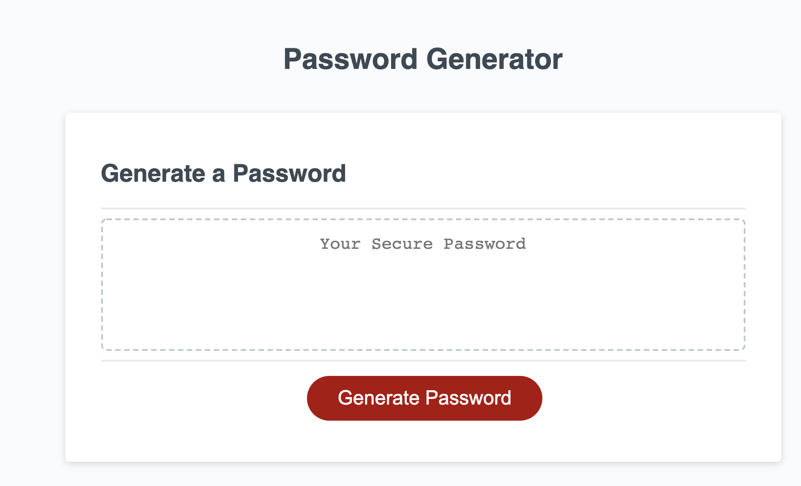
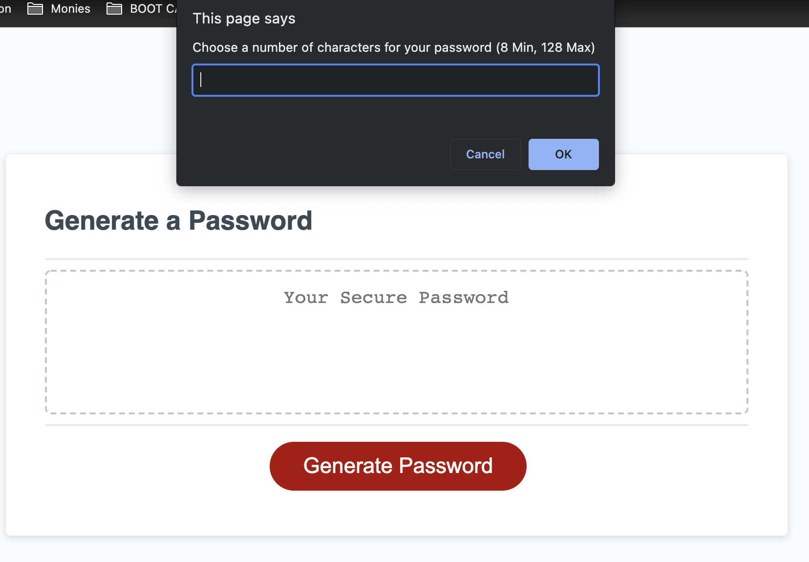
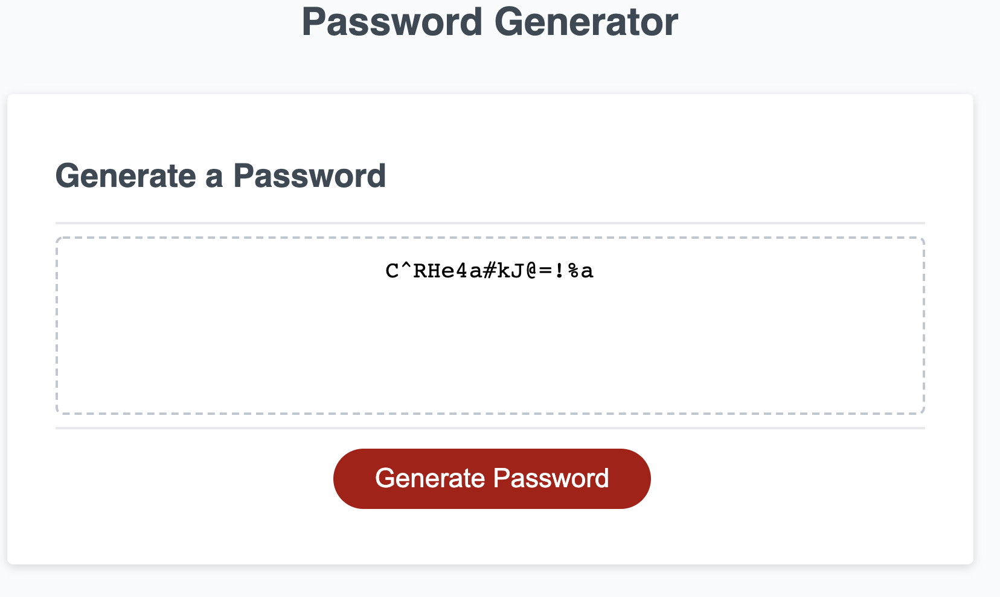

# wk3-password-generator
Password Generator

Description:

This application enables the user to generate passwords based on character criteria the user selects. The criteria options for the password is prompted to the user. Criteria includes:

- Character length (8 - 128)
- Uppercase 
- Lowercase
- Numeric
- Special Characters

Note: Between the latter 4 options at least 1 must be choosen.

Preview:

Links:

 https://github.com/Wbgc728/wk3-password-generator

  https://wbgc728.github.io/wk3-password-generator/